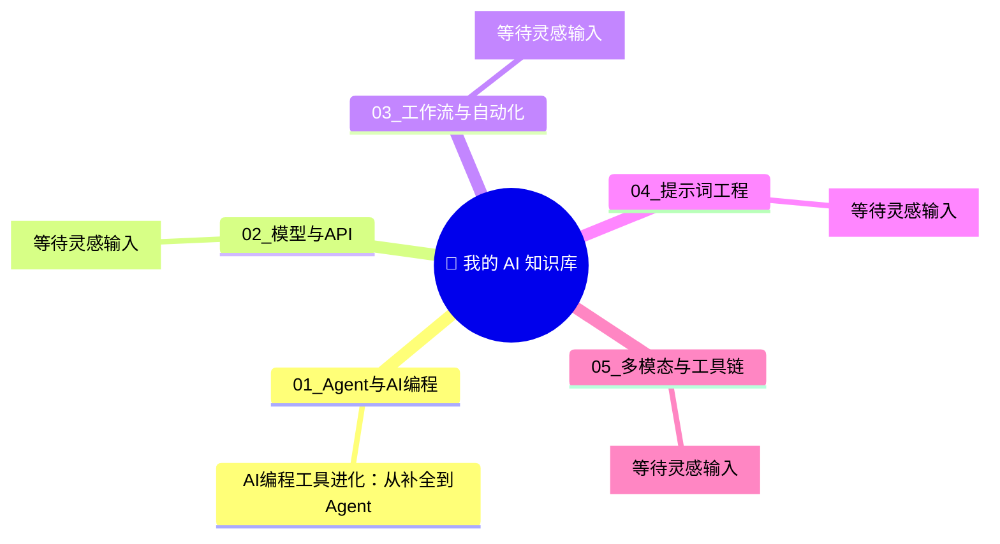
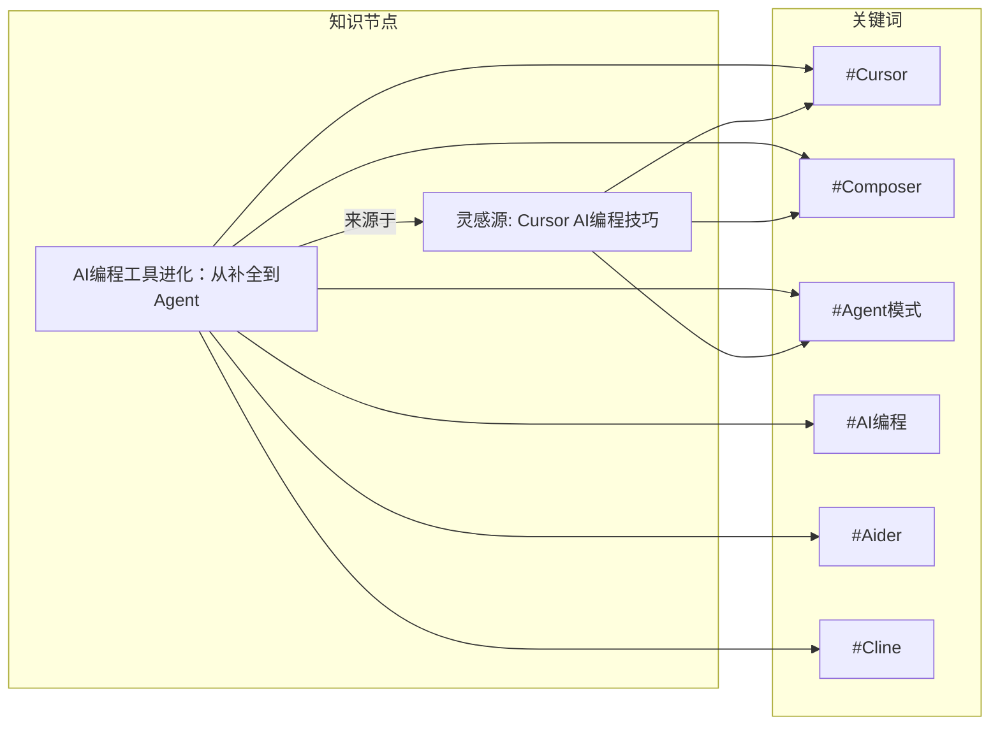

# 🕸️ 知识网络

> 可视化展示所有灵感与知识之间的连接关系。

## 知识地图

```mermaid
mindmap
  root((🧠 我的 AI 知识库))
    01_Agent与AI编程
      AI编程工具进化：从补全到Agent
    02_模型与API
      [等待灵感输入]
    03_工作流与自动化
      [等待灵感输入]
    04_提示词工程
      [等待灵感输入]
    05_多模态与工具链
      [等待灵感输入]
```

## 关联图谱

```mermaid
graph LR
    subgraph 知识节点
        n1[AI编程工具进化：从补全到Agent]
        n2[灵感源: Cursor AI编程技巧]
    end
    subgraph 关键词
        kw1[#Cursor]
        kw2[#Composer]
        kw3[#Agent模式]
        kw4[#AI编程]
        kw5[#Aider]
        kw6[#Cline]
    end
    n1 -->|来源于| n2
    n1 --> kw1
    n1 --> kw2
    n1 --> kw3
    n1 --> kw4
    n1 --> kw5
    n1 --> kw6
    n2 --> kw1
    n2 --> kw2
    n2 --> kw3
```

---

*📅 初始化于 2026-06-09 | 共 1 个知识节点 | 最后更新: 2026-06-09*
