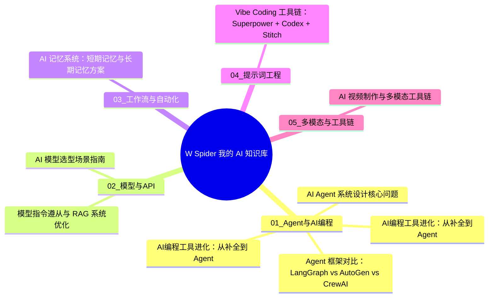
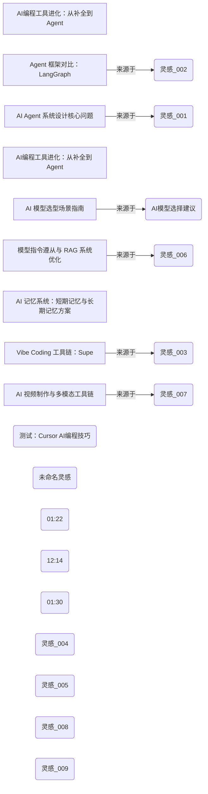

# 知识网络

> 可视化展示所有灵感与知识之间的连接关系。

## 知识地图

```mermaid
mindmap
  root((W Spider 我的 AI 知识库))
    01_Agent与AI编程
      AI编程工具进化：从补全到Agent
      Agent 框架对比：LangGraph vs AutoGen vs CrewAI
      AI Agent 系统设计核心问题
      AI编程工具进化：从补全到 Agent
    02_模型与API
      AI 模型选型场景指南
      模型指令遵从与 RAG 系统优化
    03_工作流与自动化
      AI 记忆系统：短期记忆与长期记忆方案
    04_提示词工程
      Vibe Coding 工具链：Superpower + Codex + Stitch
    05_多模态与工具链
      AI 视频制作与多模态工具链
```

## 关联图谱

```mermaid
graph LR
    n1[AI编程工具进化：从补全到Agent]
    n2[Agent 框架对比：LangGraph]
    n3[AI Agent 系统设计核心问题]
    n4[AI编程工具进化：从补全到 Agent]
    n5[AI 模型选型场景指南]
    n6[模型指令遵从与 RAG 系统优化]
    n7[AI 记忆系统：短期记忆与长期记忆方案]
    n8[Vibe Coding 工具链：Supe]
    n9[AI 视频制作与多模态工具链]
    s1(测试：Cursor AI编程技巧)
    s2(未命名灵感)
    s3(AI模型选择建议)
    s4(01:22)
    s5(12:14)
    s6(01:30)
    s7(灵感_001)
    s8(灵感_002)
    s9(灵感_003)
    s10(灵感_004)
    s11(灵感_005)
    s12(灵感_006)
    s13(灵感_007)
    s14(灵感_008)
    s15(灵感_009)
    n2 -->|来源于| s8
    n3 -->|来源于| s7
    n5 -->|来源于| s3
    n6 -->|来源于| s12
    n8 -->|来源于| s9
    n9 -->|来源于| s13
```

---

初始化于 2026-06-09 | 共 9 个知识节点 | 最后更新: 2026-06-13